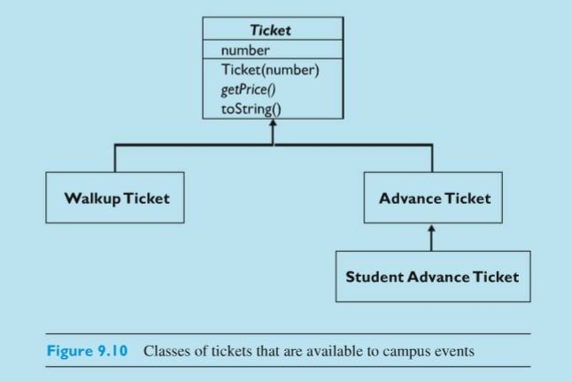
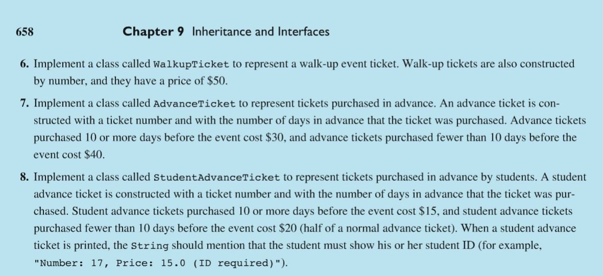

# Ticket Assignment

First Read Image attachments and understand story and check attached codes. Also Do Not Change any code in Ticket.py file.
 

    
    

    
    

    
    

1. No Ticket objects can be created (in your writing classes, see below), Yet we can create Ticket objects on TicketTester.py to check all possibilities.  I'm providing the base Class  Ticket.py so that helps do this assignment successfully.

2. Assume the field "days" is an integer, and that "price" is a float type. REQUIRED "days", coded only once, then the sub-class inherits!!!
3. Do NOT make another int days, inherit, inherit....
4. AdvanceTickets requires a parameterized constructor as per text description.  For this two parameter constructor, assume the first is the number, and the second is the days, so AdvanceTicket(3,22) is ticket number 3 purchased 22 days in advance.
5. Let's require the days field to be positive, else throw an ValueError.
6.  Inherit, inherit, inherit, wherever possible.  If you find yourself doing a copy/paste of code, then you're NOT following inheritance.  Possibly my Ticket Class I'm giving you has more code than you write to finish this assignment.  But you're task is to experiment and learn, NOT just write one line of code and submit.
7. NO print( ) function used in any of these Ticket Classes, plus add all the testing you think I would likely test...

    In reality, we should connect this to a database to verify ticket numbers etc...., but that is outside the scope now.  My Ticket Class just uses an array(list) to keep track of which ticket numbers have been used, thus avoiding duplicate ticket numbers.  Each Ticket gets a unique number, but of course that resets if you start the program all over again.

    I'm adding requirements (above), which should not violate anything stated above.  Please use this as a chance to "explore" the workings of inheritance, with rigorous adherence my specifications, and be certain the following test code works:  TicketTester.py
    
    Attached solutions in repository:
    1. Ticket.py
    2. TicketTester.py
    3. StudentAdvanceTicket.py
    4. AdvanceTicket.py
    5. WalkupTicket.py
